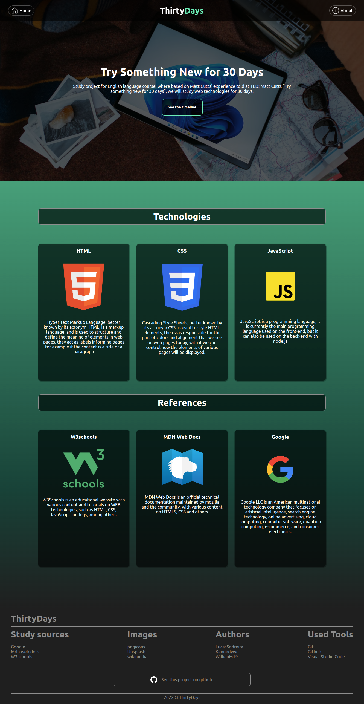

# ⏳ Site em 30 dias



Projeto de estudo das tecnologias web por 30 dias, tomando como base a palestra realizada por Matt Cutts no TED:<br> 
[Matt Cutts: "Try Something New for 30 Days"](https://www.youtube.com/watch?v=nzRvMsrnoF8)

## ℹ️ Sobre o Projeto

Criação de um Blog básico, usando tecnologias web (html, css, js).<br>

## 📂 Conteúdo Útil

- [git - guia prático](https://rogerdudler.github.io/git-guide/index.pt_BR.html)
- [w3schools](https://www.w3schools.com)
- [MDN](https://developer.mozilla.org/en-US/)

## 🤝 Contribuindo 

### 📥 Adicionando repositório
```sh
git remote add origin https://github.com/WillianM19/Site-em-30-dias-Ingles.git
git clone https://github.com/WillianM19/Site-em-30-dias-Ingles.git
```

### ➕ Mais...

- 🌟 Adicione uma estrela 
